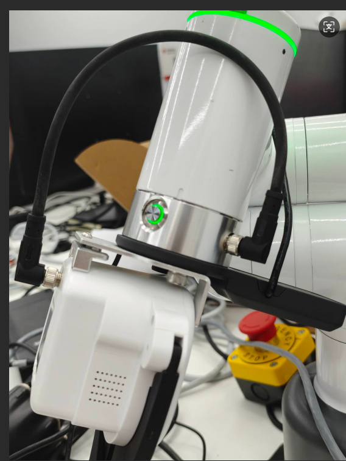
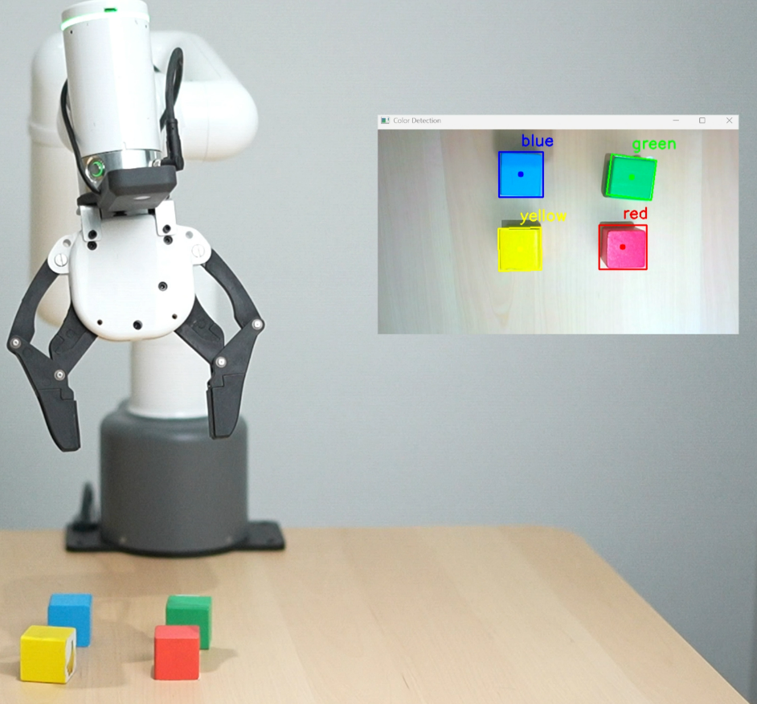
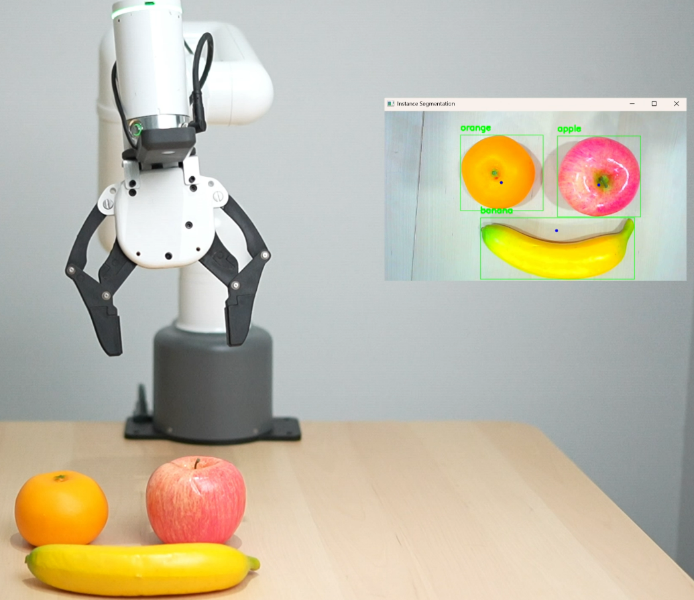

# 1 案例运行配置要求
|要求|配置|
|----|----|
|电脑类型|笔记本|
|CPU|12th Gen Intel(R) Core(TM) i7-12700H 2.30 GHz|
|GPU|NVIDIA GeForce RTX 3060以上|
|内存|16.0 GB|
|硬盘|128G 可用空间|
|系统|Windows10及以上|
|网络要求|能正常上网|
|机械臂|320M5|
|python|3.9版本以上|

# 2 硬件安装

手动将J6关节转到零刻度线上


将相机和力控夹爪法兰务必要按照下图安装到机械臂的末端上,在安装时要注意J6零刻度线不要移动,否则会导致机械臂无法正常抓取


将力控夹爪安装到法兰上即可


将M8航插线分别接到机械臂末端接口和力控夹爪接口上


最后将相机线接到电脑USB接口上


# 3 ollama安装

下载官网：https://ollama.com/


# 4 deepseek 模型安装
打开终端，输入下面命令后按下键盘回车键安装
```bash
ollama run deepseek-r1:7b
```

安装完后，重启电脑即可

# 5 百度API创建


## 注册百度AI开放平台账号
首先，访问[百度AI开放平台](https://ai.baidu.com/)，注册并登录你的账号。


## 创建应用并获取APP_ID、API Key和Secret Key
在百度AI开放平台控制台中，创建一个新的应用，选择“语音识别”服务，完成应用创建后，你将获得一对API Key和Secret Key以及APP_ID，用于后续的API调用认证。


# 5 源码获取
下载地址：https://github.com/elephantrobotics/320_deepseek_demo

把压缩包下载后解决后即可进行环境部署


## 依赖库安装
```bash
pip install -r requirements.txt
```


## API_Key填写
在API_Key.py脚本文件,填写你的百度的APP_ID，API Key，Secret Key即可

# 7 案例复现

运行 deepseek_demo.py,按下回车键，便会开始录音

**注意事项**
在录音时，需在一个安静的环境下进行，在语音转文字时可能会出现转换不对的情况，可等机械臂完成动作后，再重新按回车键说指令


## 移动展示

**语音命令词**：
```bash
向前移动50毫米，向后移动40毫米，向左移动30毫米，向右移动60毫米。
```

## 颜色识别
颜色木块要摆放的规整一点，且要木块之间要保留一定的距离，否则机械臂无法正常完成抓取
，可参考下图摆放



**语音命令词**：
```bash
先把番茄一样颜色的木块拿走,再把和香蕉一样颜色的木块拿走。
```
## 水果识别
水果模型要摆放的规整一点，且要水果模型之间要保留一定的距离，否则机械臂无法正常完成抓取，可参考下图摆放。若是要抓取香蕉，香蕉要竖着放置



**语音命令词**：
```bash
我现在有点口渴，帮我拿个橙子。
```

```bash
我现在有点饿，帮我拿个苹果。
```
**注意事项**：目前水果识别仅支持识别苹果，橙子，香蕉

## 药品识别
要抓取的药盒必须规整竖直放置，不能有太大的角度偏差，且药盒之间要保留一定的距离，否则机械臂无法正常完成抓取，可参考下图摆放。


**注意事项**：目前药盒识别仅支持识别999感冒灵颗粒和云南白药创可贴，若要复现，请提前准备此药盒

**语音命令词**：
```bash
我有点流鼻涕和鼻塞，帮我取个治疗这个症状的药。
```

## 案例视频

<!-- 视频链接：https://www.bilibili.com/video/BV1coMczkEGd/?spm_id_from=333.337.search-card.all.click&vd_source=672e3f7240eaaca210b45e7c033dc45f -->


<!-- 
<video class="elementor-video" src="https://www.bilibili.com/video/BV1coMczkEGd/?spm_id_from=333.337.search-card.all.click&vd_source=672e3f7240eaaca210b45e7c033dc45f" autoplay="" loop="" controls="" controlslist="nodownload"></video> -->

<video width="640" height="480" controls>
  <source src="https://www.bilibili.com/video/BV1coMczkEGd/?spm_id_from=333.337.search-card.all.click&vd_source=672e3f7240eaaca210b45e7c033dc45f" type="video/mp4">
  <!-- <source src="movie.ogg" type="video/ogg"> -->
  。
</video>