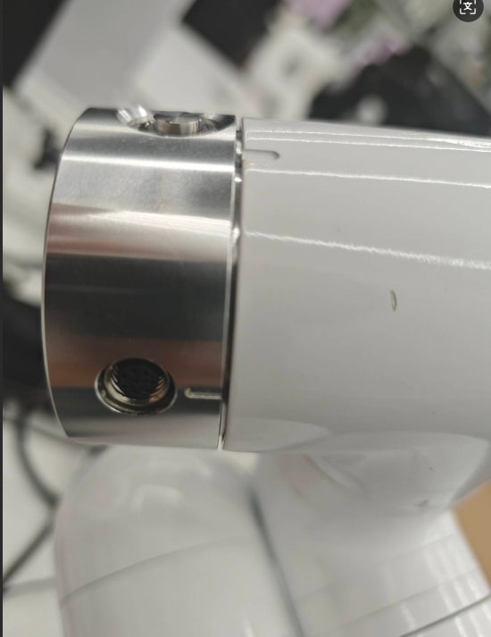
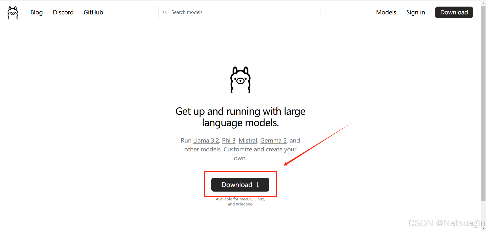
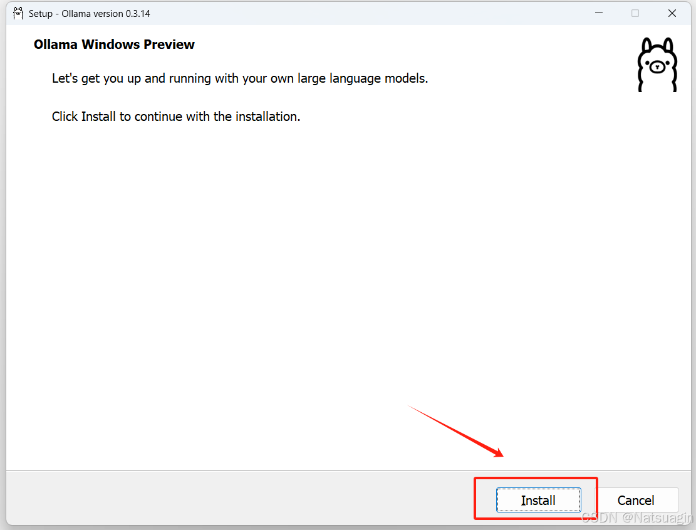
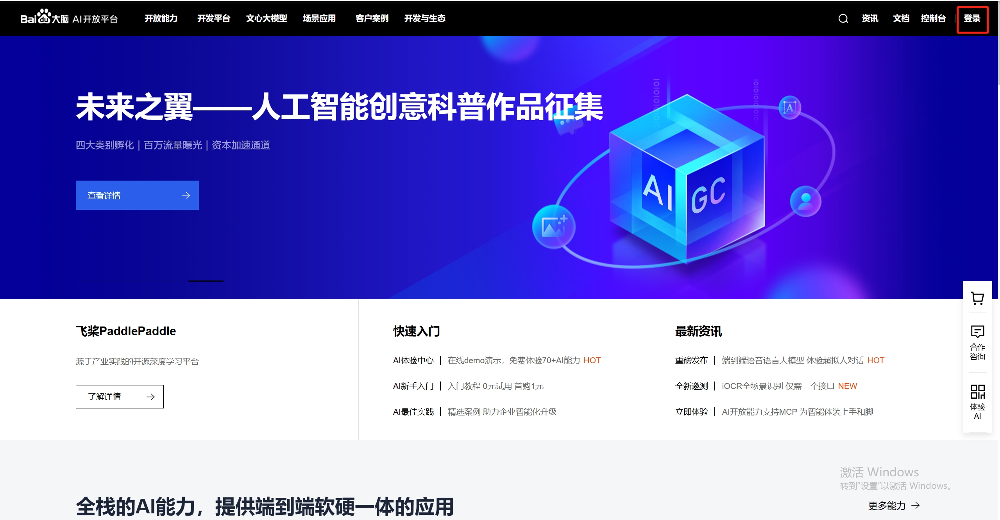
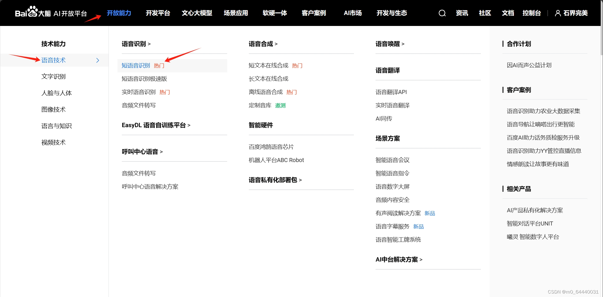
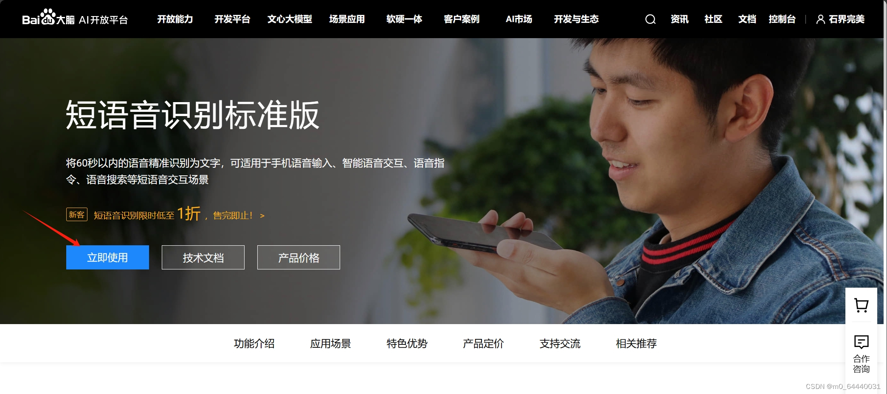
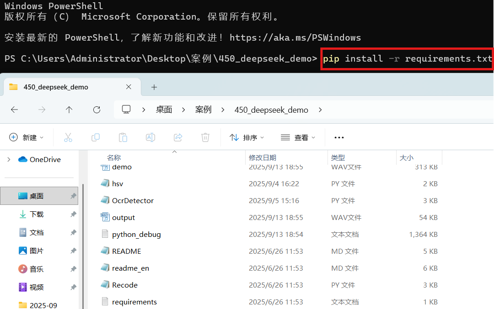
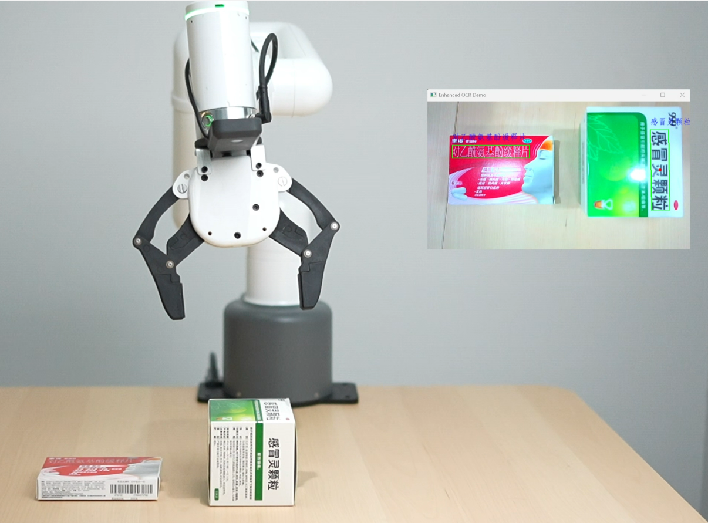

# 1 Case running configuration requirements
|Requirements|Configuration|
|----|----|
|Computer type|Laptop|
|CPU|12th Gen Intel(R) Core(TM) i7-12700H 2.30 GHz|
|GPU|NVIDIA GeForce RTX 3060 or above|
|Memory|16.0 GB|
|Hard disk|128G available space|
|System|Windows 10 and above|
|Network requirements|Able to access the Internet normally|
|Robotic arm|450M5|
|Python|Version 3.9 or above|

# 2 Hardware installation

Manually turn the J6 joint to the this scale line



Be sure to install the camera and force control gripper flange to the end of the robot arm according to the figure below. During installation, be careful not to move the J6 zero scale line, otherwise the robot arm will not be able to grasp normally


Install the force control gripper on the flange


Connect the M8 aviation plug cable to the end interface of the robot arm and the force control gripper interface respectively


Finally, connect the camera cable to the computer USB port

# 3 ollama installation

Download official website: https://ollama.com/






# 4 deepseek Model installation
Open the terminal, enter the following command and press Enter to install
```bash
ollama run deepseek-r1:7b
```
After installation, restart the computer

# 5 Baidu API creation

## Register Baidu AI Open Platform account
First, visit [Baidu AI Open Platform](https://ai.baidu.com/), register and log in to your account.



## Create an application and obtain APP_ID, API Key and Secret Key
In the Baidu AI Open Platform console, create a new application and select the "Speech Recognition" service. After completing the application creation, you will get a pair of API Key and Secret Key as well as APP_ID for subsequent API call authentication.






# 5 Source code acquisition
Download address: https://github.com/elephantrobotics/450_deepseek_demo

Download the compressed package and solve it before deploying the environment


## Dependency library installation
```bash
pip install -r requirements.txt
```


## API_Key fill in
In the API_Key.py script file, fill in your Baidu APP_ID, API Key, Secret Key

# 7 Case reproduction

Run deepseek_demo.py, press the Enter key, and the recording will start

**Notes**
When recording, it is necessary to do it in a quiet environment. When converting voice to text, the conversion may be incorrect. You can wait until the robot arm completes the action, and then press the Enter key again to speak the command

## Mobile display

**Voice command words**:
```bash
向前移动50毫米，向后移动40毫米，向左移动30毫米，向右移动60毫米。
```

## Color recognition
The colored wooden blocks should be placed neatly, and a certain distance should be kept between the wooden blocks, otherwise the robot arm cannot complete the grasping normally
, please refer to the following figure for placement


**Voice command words**:
```bash
先把番茄一样颜色的木块拿走,再把和香蕉一样颜色的木块拿走。
```
## Fruit recognition
The fruit models should be placed neatly and a certain distance should be kept between them, otherwise the robot arm cannot grasp them normally. Please refer to the following figure for placement. If you want to grasp a banana, place it vertically


**Voice command**:
```bash
我现在有点口渴，帮我拿个橙子。
```

```bash
我现在有点饿，帮我拿个苹果。
```
**Note**: Currently, fruit recognition only supports the recognition of apples, oranges, and bananas

## Drug recognition
The medicine boxes to be grasped must be placed neatly and vertically, without too much angle deviation, and a certain distance should be kept between the medicine boxes, otherwise the robot arm cannot grasp them normally. Please refer to the following figure for placement.



**Notes**: Currently, the medicine box recognition only supports the recognition of 999 Ganmao Ling Granules and Yunnan Baiyao Band-Aids. If you want to reproduce, please prepare this medicine box in advance

**Voice command words**:
```bash
我有点流鼻涕和鼻塞，帮我取个治疗这个症状的药。
```

## Case video

<!-- Video link: https://www.bilibili.com/video/BV1coMczkEGd/?spm_id_from=333.337.search-card.all.click&vd_source=672e3f7240eaaca210b45e7c033dc45f -->

<!--
<video class="elementor-video" src="https://www.bilibili.com/video/BV1coMczkEGd/?spm_id_from=333.337.search-card.all.click&vd_source=672e3f7240eaaca210b45e7c033dc45f" autoplay="" loop="" controls="" controlslist="nodownload"></video> -->

<video width="640" height="480" controls> 
<source src="https://www.bilibili.com/video/BV1coMczkEGd/?spm_id_from=333.337.search-card.all.click&vd_source=672e3f7240eaaca210b45e7c033dc45f" type="video/mp4"> 
<!-- <source src="movie.ogg" type="video/ogg"> --> 
.

</video>

